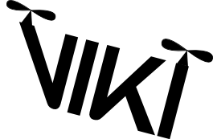

.. AeroWorks documentation master file, created by
   sphinx-quickstart on Mon Mar 30 16:58:54 2015.
   You can adapt this file completely to your liking, but it should at least
   contain the root `toctree` directive.

.. _home:

VIKI documentation
==================

VIKI is software aiming to enable the quick and easy start up of experiments involving ROS. Development has started in 2014 at the University of Twente under funding of project Aeroworks. VIKI can help a student that is new to a experimental setup to quickly start where the previous contributor stopped.For example: if you are designing a position-controlled quadrotor, based on on-board camera and IMU info, you can immediately start a position-controlled drone based on external cameras (OptiTrack), redo/validate the experiments of the researcher who created that setup, and focus on your research in stead of on peripherals.

The repository can be found on github: http://www.github.com/UT-RAM/viki. If you have any issues, please contact :ref:`developers` or place on issue on github.

This documentation is split up into three parts, each having its own goal:

#. :ref:`User` aims at the regular VIKI users which are not developing their own modules. This start with :ref:`Installation` and :ref:`Quick start guide` to get up and running with VIKI.
#. :ref:`Contributor` aids people at writing their own modules for VIKI.
#. :ref:`Developer` is for internal documentation on VIKI or for people wanting to know more about the internals of VIKI.

.. todolist::

Contents
--------

.. toctree::
   :maxdepth: 2

   user
   contributor
   developer
   developers

Automatically generated pages
-----------------------------
* :ref:`genindex`
* :ref:`modindex`
* :ref:`search`