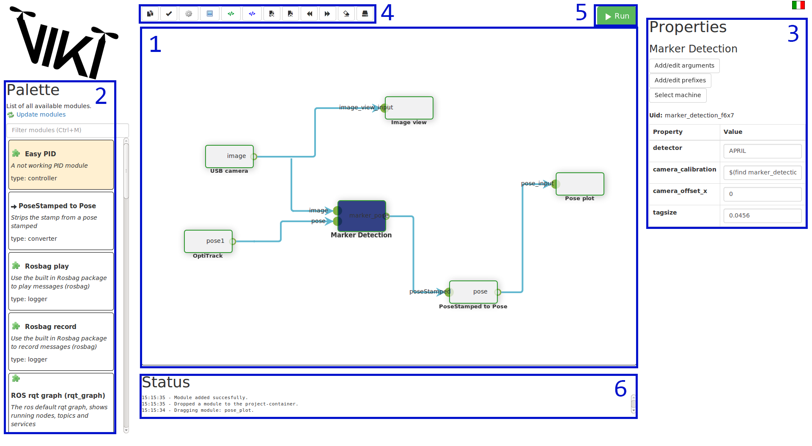

.. _quickstart:
.. _`Quick start guide`:

Quick start guide
=================

This guide assumes you have installed VIKI succesfully. If you have not, check out :ref:`installation`. Using this guide you can run your first setup: controlling a turtle-simulator with your keyboard.

Launching VIKI
--------------
First off, you will have to start VIKI. Open a terminal, navigate to the installation folder of viki (usually *~/catkin_ws/src/viki*) and execute

.. code-block:: bash

    ./viki run

You should see a screen pop up with the interface of VIKI.

A quick look at the interface
-----------------------------
After launching VIKI, we can take a look at the interface and the elements that the interface provides:

1. **Canvas**: This is where you will build your project.
2. **Module Palette**: This shows all the modules that are available.
3. **Module specifics**: Once a module is selected, this pane shows all the parameters that are available for this module. Furthermore, there are three buttons to edit arguments, prefixes and select the machine that this module will run on.
4. **Toolbar**: Here are the basic actions that you will need during use. Hover over each button to see its purpose
5. **Run button**: Press this button to run the setup you created.
6. **Status pane**: This shows some status information, which can basically be used for debugging.

People that are familiar with for example Simulink probably recognize this layout. You can search for modules that you need in your project in the palette, when you have found a module that you need, you can drop it to the canvas, connect it with other modules and run your project to see all the magic happen. During the next few steps, we will guide you through your first launch.

Launching your first project
----------------------------

In this quick guide, I will guide you through launching your first project with VIKI using the turtlesim. We need two modules for this setup: the turtle simulator and a module that interprets input from your keyboard and sends it to the simulator. Below the VIKI-logo you can search for modules by clicking in the textbox and entering *turtle*. You will see two modules called:

- turtle_teleop_key
- turtlesim node

You need both of these. Click and drag each of these modules to the canvas. You should now see two loose modules visible on your canvas.

Now that we have the two modules, we need to connect them. We will need to connect the output of *turtle_teleop_key* to the input of *turtlesim node*. You can do this by dragging the teleop's output node to the turtle's input node. An arrow will appear that indicates the direction of information. Notice that you can not start dragging at the turtle's input node: you need to follow the direction of information.

Your setup is now ready. Hit the green *run* button on top of the screen. A new terminal should open that gives some text feedback. This terminal is used to open your complete setup. More importantly, you should also see a window with a turtle in it. If you focus your input on the text window (click somewhere on it) then you can use your arrow keys to control the turtle in the other window.

When you're done playing around with the turtlebot, you can select the terminal window and press `Ctrl + C`, which will kill its processes. After gracefully shutting down, the terminal window will disappear, and you're free to again run your canvas setup.

Where to move from here?
------------------------

Know that you know the basic functionality of VIKI, you're basically ready to go! Probably, you'll want to write some own specific functionality by adding your own modules. If this is the case, you can go to the :ref:`Contributor` page to see more information about writing your own module. For more functionality, you can check out the :ref:`features` page or take a look at :ref:`sshdoc` functionality. If you want to learn more about the vision, background and core of VIKI, or want to contribute to the core, you can visit the :ref:`Developer` page.